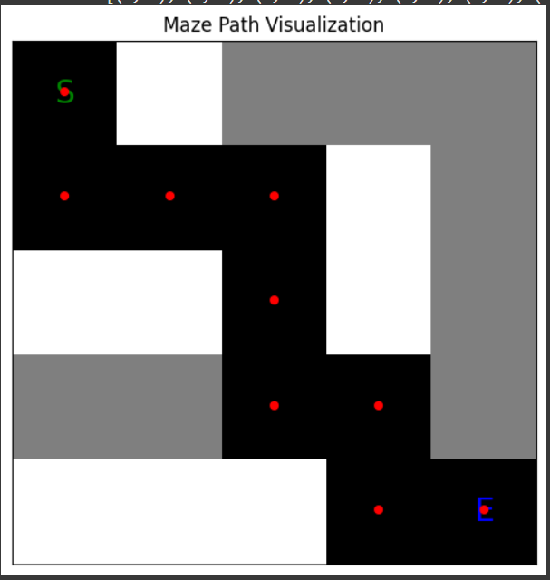

# Maze Solving using Backtracking

## 📄 Project Overview
This project implements a **backtracking algorithm** to solve a 2D maze. The goal is to find a path from a starting point to an endpoint in a grid-based maze using **Python**. It leverages libraries like **NumPy** and **Matplotlib** for efficient computation and visualization.

## 🧩 Science Behind It
Backtracking is a recursive algorithmic technique used for solving problems incrementally by exploring all possible configurations and abandoning non-viable paths:
- **Validity Check**: Ensures the current cell is within the maze boundaries and not blocked.
- **Recursive Exploration**: Marks the cell as part of the path and recursively moves in predefined directions.
- **Backtracking**: If no valid moves are available, the algorithm backtracks to explore alternative routes.

Compared to other algorithms like **BFS** and **DFS**, backtracking is efficient in navigating complex mazes with obstacles.

## 🛠 Components Used
- **Programming Language**: Python
- **Libraries**:
  - **NumPy**: For efficient array manipulation
  - **Matplotlib**: For maze visualization
- **Development Environment**: Google Colab

## 🚀 Working Model
The maze is represented as a 2D grid:
- **'1'** denotes empty space
- **'0'** denotes obstacles
- **'S'** (Start) and **'E'** (End) are special markers.

##Before solving:

-

##After solving:

-

## 📊 Results & Conclusion
The backtracking algorithm efficiently identifies viable solutions by exploring all potential paths. It demonstrates practical applications in fields like **robotics** and **AI**, where pathfinding is essential. The visualization enhances comprehension of the maze-solving process.

### Future Work
- Implementing the algorithm for **dynamic mazes** with real-time obstacle changes.
- Integrating other pathfinding algorithms for performance comparison.
